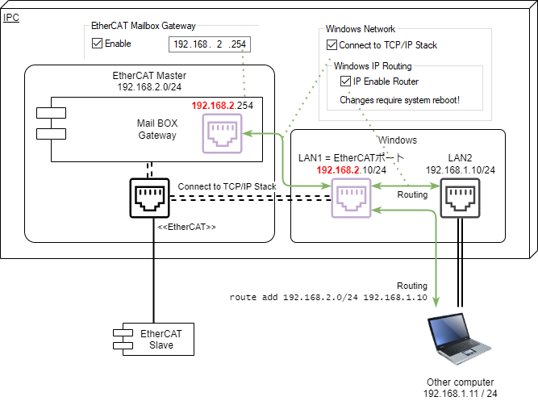

# ETG.1510 Master Diagnosis Interface client library for Python

本パッケージは、EtherCATマスタから診断情報を収集するクライアントソフトウェアです。

Mailbox Gateway(ETG.8200)を経由し、UDP/IPによりEtherCATマスタのSDOエントリに格納された各種診断 情報（ETG.1510）を収集します。

EtherCATマスタが、全てのETG.1510のオブジェクトディクショナリ（OD）すべてをサポートしているとは限りません。また、ETG.1510 で規定されている
``VISIBLE_STRING``はサイズが固定ではなく、EtherCATマスタの仕様に依存します。

したがって、本ライブラリでは次のとおり二つの機能をサポートします。

1. SDO Information Service により、EtherCATマスタのオブジェクトディクショナリ情報を収集します。
2. 収集したOD情報に基づき、SDO Uploadコマンドにより診断データを収集します。

## インストール

```shell
$ pip install pyetg1510
```

## 接続準備

本クライアントを実行するコンピュータからEtherCATマスタが存在するコンピュータと別の場合、ネットワーク設定が必要です。
例えばBeckhoff TwinCATでは、次図のとおりEtherCATマスタとWindowsで明確な境界があります。



このため、次のとおりOSのネットワーク設定を行う必要があります。

### EtherCATマスタのあるコンピュータで実行する場合

Mailboxゲートウェイのホストアドレス（IPアドレス）を設定してください。図の例では`192.168.2.254`とします。

* WindowsネットワークとMailboxゲートウェイを接続、および、IP Routingを有効にしてください。
* Windowsのネットワーク設定で、EtherCATが占有しているネットワークカードに対するIPアドレスを設定します。図の例では`192.168.2.10/24`とします。
* Windowsのネットワーク設定で、外部のLANと接続するネットワークカードに対するIPアドレスを設定します。図の例では`192.168.1.10/24`とします。

### EtherCATマスタを外部から接続したリモートコンピュータで実行する場合 (**非推奨**)

前節の項目の設定に加えて以下の対応が必要です。ただし、セキュリティ上問題がありますのでお勧めしません。

* ファイアウォール設定でUDP/IP の Port 34980 のInboundを許可します
* リモートコンピュータのIPアドレスを、EtherCATマスタのコンピュータと接続したネットワークと同じネットワークアドレスでIPアドレスを設定します。図の例では、`192.168.1.11/24`とします。
* Windowsであれば管理者モードでターミナル軌道し、次のとおりrouteコマンドを入力します。Mainboxゲートウェイの192.168.2.254へ接続するには、192.168.1.10にルーティングしてもらうための設定です。
    
   ``` powershell
   > route add 192.168.2.0/24 192.168.1.10
   ```

## クイックスタート

``` python
from pyetg1510 import EtherCATMasterConnection, MasterODSpecification, ETG1510Profile
from dataclasses import fields
import asyncio
from pprint import pprint


async def get_etg1510_data(etg1510: ETG1510Profile):
    """インデックスを指定してSDOを取得する例"""

    await etg1510.master_od.get_object_dictionary()
    """SDO Information serviceによりメインデバイスODデータを収集"""

    whole_list = list(etg1510.sdo_database.keys())
    """マスターのODからインデックスリストを取得する"""
    
    watch_list = list(filter(lambda x: 0xa000 <= x <= 0xafff, whole_list))
    """0xa000から0xafffまでのリストにフィルタリング"""

    for index in watch_list:
        sdo = await etg1510.get_sdo(index)
        """get_sdoメソッドでインデックスを指定してSdoDataBody型のSDOを取得する"""
        pprint({hex(index): {f.name: getattr(sdo, f.name).value for f in fields(sdo)}})

async def get_etg1510_whole_data(etg1510: ETG1510Profile):
    """イテレータを用いて全てのSDOを順次取得する例"""

    await etg1510.master_od.get_object_dictionary()
    """SDO Information serviceによりメインデバイスODデータを収集"""

    async for entry, data in etg1510:
        """
        非同期イテレータにより順次SDOインデックスとそのデータのタプルを順次取得してpprintで整形して標準出力
    
        Returns:
            entry(int): SDO インデックス
            data(dataclass): complete accessで取得した全エントリをdataclassをコンテナとして取得。
                             dataclassのメンバはSdoEntry型として取得可能。
        """
        pprint({hex(entry): {
                    f.name: getattr(data, f.name).value for f in fields(data)
                }
            }
        )

if __name__ == '__main__':
    connection = EtherCATMasterConnection('192.168.2.254', 34980)
    """UDP/IP通信インスタンス作成。Mailbox gatewayのIPアドレス, Portを指定"""
    master_od = MasterODSpecification(connection=connection)
    """SDO Information servieのインスタンス作成"""
    etg1510 = ETG1510Profile(master_od=master_od)
    """ETG.1510 の診断データイテレータ作成"""
    asyncio.run(get_etg1510_data(etg1510))
    """非同期タスクによりETG.1510のSDOデータを収集"""
```

上記のプログラムを実行すると、以下のとおり標準出力されます。

```bash
$ python etg1510.py
{'0x1000': {'DeviceType': 0}}
{'0x1008': {'DeviceName': 'TwinCAT EtherCAT Master'}}
{'0x1009': {'HardwareVersion': '0'}}
{'0x100a': {'SoftwareVersion': '3.1 1737'}}
{'0x1018': {'NumberOfEntries': 4,
            'ProductCode': 65539,
            'RevisionNumber': 1737,
            'SerialNumber': 0,
            'VendorID': 2}}
{'0x8000': {'DeviceType': 0,
            'DiagHistoryObjectSupported': False,
            'FixedStationAddress': 1001,
            'Flags': 0,
            'LinkPreset': 17,
            'LinkStatus': 0,
            'MailboxInSize': 0,
            'MailboxOutSize': 0,
            'MailboxProtocolsSupported': 0,
            'Name': 'Term 1 (EK1100)',
            'NumberOfEntries': 37,
            'PortPhysics': 0,
            'ProductCode': 72100946,
            'RevisionNumber': 1114112,
            'SerialNumber': 0,
            'Type': 'EK1100',
            'VendorId': 2}}
{'0x8001': {'DeviceType': 0,
            'DiagHistoryObjectSupported': False,
            'FixedStationAddress': 1002,
            'Flags': 0,
            'LinkPreset': 17,
            'LinkStatus': 0,
            'MailboxInSize': 0,
            'MailboxOutSize': 0,
            'MailboxProtocolsSupported': 0,
            'Name': 'Term 2 (EL1012)',
            'NumberOfEntries': 37,
            'PortPhysics': 0,
            'ProductCode': 66334802,
            'RevisionNumber': 1048576,
            'SerialNumber': 0,
            'Type': 'EL1012',
            'VendorId': 2}}
              :
              :
{'0xa000': {'ALControl': 8,
            'ALStatus': 8,
            'ALStatusCode': 0,
            'AbnormalStateChangeCounter': 0,
            'CyclicWCErrorCounter': 0,
            'DisableAutomaticLinkControl': False,
            'FixedAddressConnPort': [0, 1002, 0, 0],
            'FrameErrorCounterPort': [0, 0, 0, 0],
            'LastProtocolError': 0,
            'LinkConnStatus': 50,
            'LinkControl': 240,
            'NewDiagMessageAvailable': False,
            'NumberOfEntries': 17,
            'SlaveNotPresentCounter': 7}}
{'0xa001': {'ALControl': 8,
            'ALStatus': 8,
            'ALStatusCode': 0,
            'AbnormalStateChangeCounter': 0,
            'CyclicWCErrorCounter': 1,
            'DisableAutomaticLinkControl': False,
            'FixedAddressConnPort': [1001, 1003, 0, 0],
            'FrameErrorCounterPort': [0, 0, 0, 0],
            'LastProtocolError': 0,
            'LinkConnStatus': 51,
            'LinkControl': 240,
            'NewDiagMessageAvailable': False,
            'NumberOfEntries': 17,
            'SlaveNotPresentCounter': 7}}
              :
              :
{'0xf002': {'NumberofEntries': 67,
            'ScanCommandRequest': '\x04\x06',
            'ScanCommandResponse': '',
            'ScanCommandStatus': 0}}
{'0xf020': {'ConfiguredAddress': 1001, 'NumberofSlaves': 10}}
{'0xf120': {'ACyclicFramesPerSecond': 0,
            'ACyclicLostFrames': 98826091,
            'CyclicFramesPerSecond': 0,
            'CyclicLostFrames': 66,
            'MasterState': 0,
            'NumberOfEntries': 2}}
{'0xf200': {'NumberOfEntries': 1, 'ResetDiagInfo': False}}

```
